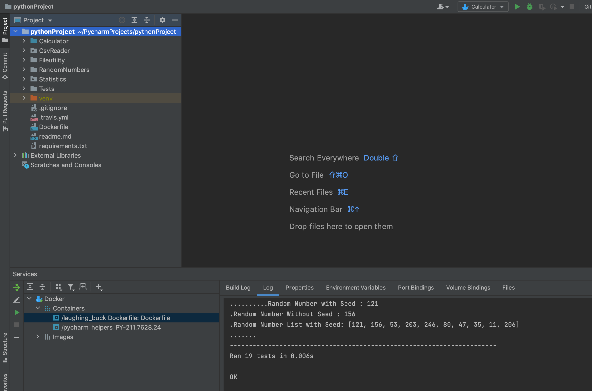

## IS601 - Calculator Project

This project Contains below Operations:

Calculator Functions:

1. Addition
2. Subtraction
3. Multiplication
4. Division
5. Square
6. Square Root

Statistics Methods:

1. Mean
2. Median
3. Mode
4. Variance
5. Standard Deviation

Random Number Generator Methods

1. Random Number between 2 numbers with Seed 
2. Random Number between 2 numbers without Seed
3. Random Number List between 2 numbers with Seed

